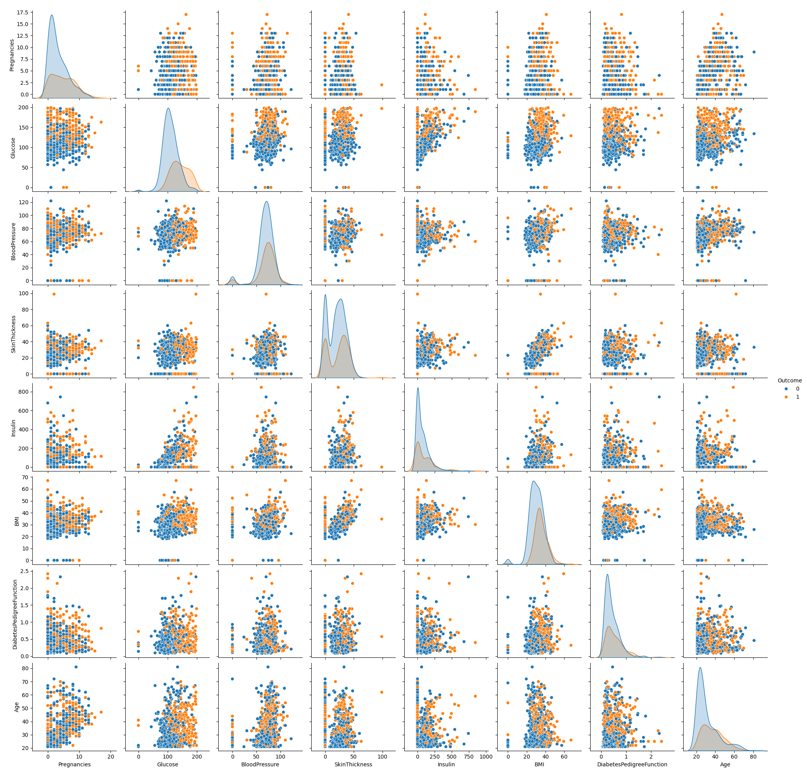
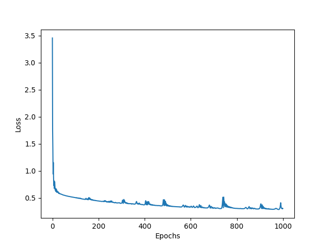
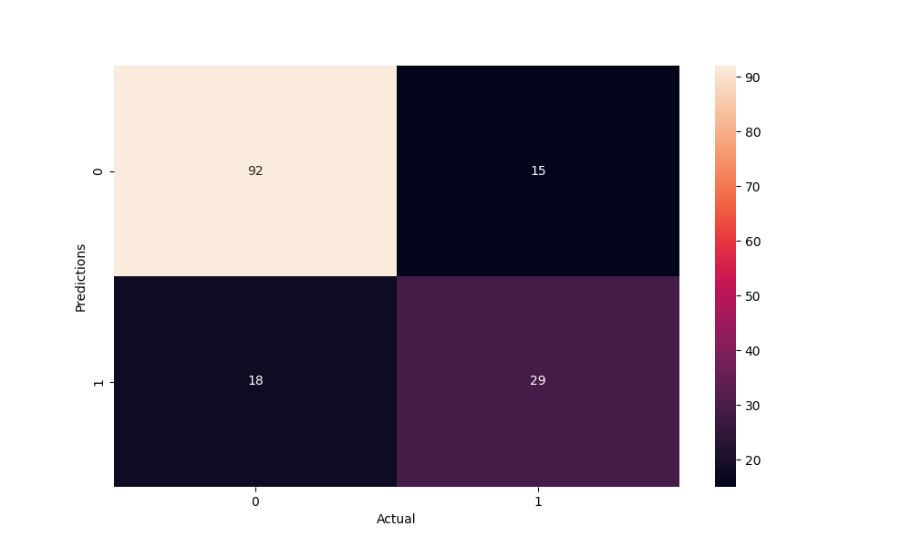

# Diabetes Prediction

This is a Python based Neural Netowrk to predict Positive or Negative Diabetes in Patients given some parameters.

It is an easy to use, simple and efficient Machine Learning Model. Data pre-processing is done Using Pandas and Numpy, while most of the Neural Network is created using PyTorch library.


# Table of Contents

- [Project Title](#diabetes-prediction)
- [Table of Contents](#table-of-contents)
- [Python Packages Used](#python-packages-used)
- [Requirements](#requirements)
- [Usage](#usage)
- [Model Architechture](#model-architechture)
- [Training Data](#training-data)
- [Visualisations](#visualisations)
- [Results](#results)


# Python Packages Used
[(Back to top)](#table-of-contents)


- **General Purpose** : General purpose package `argparse` for passing model parameters liek seed value and Learning Rate from the command line.

- **Data Manipulation** : Packages used for handling,importing dataset, creating train-test split and confusion matrix, such as `pandas`,`numpy` and `sklearn`.

- **Data Visualization** : `matplotlib` and `Seabron` for data Visualization.

- **Machine Learning** : Machine learning package `PyTorch` for The Neural Netowrk, optimisers and loss functions.

# Requirements
[(Back to top)](#table-of-contents)

Assuming the *requirements.txt* file is present on your local directory, run the following command on the command line to install all the dependencies of the Project.

```
pip install -r requirements.txt
```


# Usage
[(Back to top)](#table-of-contents)

To train the model, two parameters have to be passed, *seed* value to facilitate reproducibilty of results, number of *Epochs* you want to train your model and Leanrning Parameter *alpha* for the Optimisation Algorithm.
```
python3 train.py --seed SEEDVALUE --epochs EPOCHS --alpha LEARNINGPARAMETER
```

# Model Architechture
[(Back to top)](#table-of-contents)

**Neural Netowrk**:
- Input (8 features)
- Fully Connected Layer (20 Neurons) followed by *Relu* activation
- Fully Connected Layer (20 Neurons) followed by *Relu* activation
- Fully Connected Output Layer (2 Neurons)
- Output (2 features)

**Optimiser** : Adam Optimiser

**Loss Function** : Cross Entropy Loss

# Training Data
[(Back to top)](#table-of-contents)

Training Data contains 768 examples with 8 columns with one of them being the boolean value of a Patient being Diabetic.

**Columns**: 

- Pregnancies 
- Glucose 
- BloodPressure
- kinThickness
- Insulin
- BMI
- Diabetes
- PedigreeFunction
- Age
- Outcome

# Visualisations
[(Back to top)](#table-of-contents)

Using *Seaborn* library, Pairplots are created for Outcome Column with every other column.




Using *Matplotlib* library, Loss Values are projected with each epoch.




Now, again Using *Seaborn* library, Confusion Matrix is created to check Accuracy of the model.




**Note** : 
Parameters for these observations, 
seed: 100
epohs: 1000
learning_rate: 0.01


# Results
[(Back to top)](#table-of-contents)

Using *sklearn* , Accuracy Score is calculated which comes out to be **78.5714%** for above mentioned set of parameters.

Hence, for a Model this simple, an Accuracy score of 78% is good enough. Increasing layers(or Neurons per layers) or applying Normalisations may also result in the increase of Accuracy Score.
